# DFS-Namespace On Azure Files
DFS Namespaces is a role service in Windows Server that enables you to group shares located on different servers into one or more logically structured namespaces. This makes it possible to give users a virtual view of shared folders, where a single path leads to files located on multiple servers. This article will go over some steps to setup DFS-N on Azure Files. 

You will need DFS-N on Azure Files directly if:

  1. You do not have an Azure File Sync as Azure Files is sufficient for your use case.
  2. A unified namespace across all disparate shares is needed.
  3. A larger share size all under same name is required. 
  4. A particular share name wants to be retained.

Azure Files is a fully manages SMB file share in Azure which can be leveraged for your convinient lift-and-shift of file servers. Data in Azure Files can be accessed in many different ways with the following two being dominant:
  1. **Direct SMB access to Azure Files** by mounting Azure Files Share directly either from on-premises or within Azure
  2. Continue to access the local file server by configuring **Azure Files Sync** which provides you a way to turn on-premises Windows Server into a fast disposable cache of most frequently accessed data with data tiering setup into Azure Files. If you have Azure File Sync configured, DFS-N with **Azure File Sync needs no changes** and you will **not need these instructions**. Your DFS-N will continue to work as is.

Step 1 – Create a local user with same name as storage account and storage account key as Password
==================================================================================================

Create a Storage Account And File Shares
----------------------------------------

-   Create a Storage Account using the Azure Portal

-   Create some file shares. In my case below I created a storage account with
    name standardgrsstacct and created 4 file shares namely – configs, docs,
    images, logs.

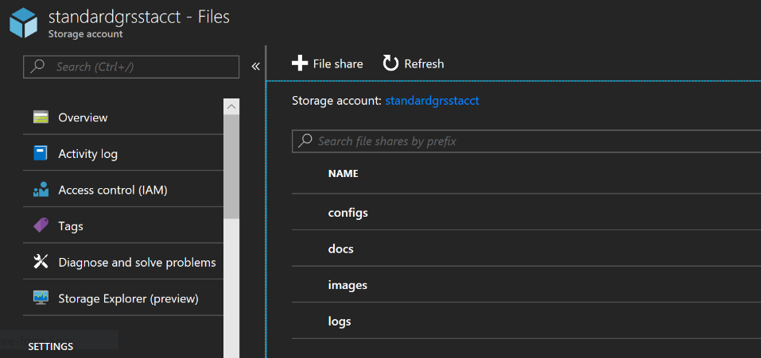

-   Go to the portal to get your azure **storage account name** and **storage
    account key**

-   Go to the URL by substituting relevant values

-   [https://ms.portal.azure.com/resource/subscriptions/\<SubscriptionID\>/resourceGroups/\<ResourceGroupName\>/providers/Microsoft.Storage/storageAccounts/\<StorageAccountName\>/keys](https://ms.portal.azure.com/resource/subscriptions/%3cSubscriptionID%3e/resourceGroups/%3cResourceGroupName%3e/providers/Microsoft.Storage/storageAccounts/%3cStorageAccountName%3e/keys)

-   You will be able to copy your account name and key by clicking on the
    highlighted copy button.

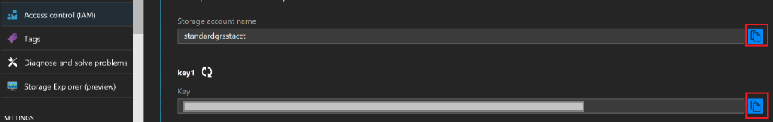

Create a new local user
-----------------------

-   Go to the server on which you want to setup your DFS-N (henceforth referred
    to as DFSN-Server). In my case it is pfsdemo1

-   Click on Computer Management from the Start menu

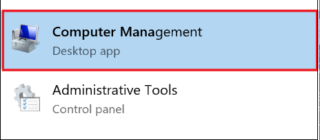

-   Create a new user with name of the storage account and password that is
    Storage Account Key.

-   Make sure this new user has read permissions on C:\\

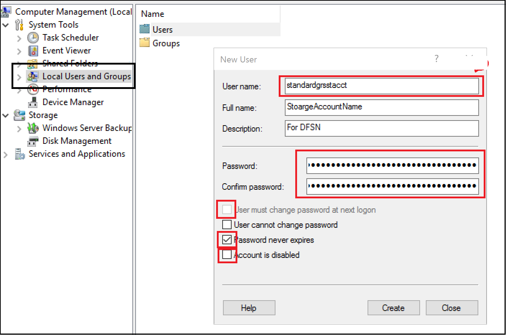

Step 2 - Enable DFS Namespace Role
==================================

Add DFS-N role
--------------

-   Go to Server Manager and Click on “**Add Roles and Features**”

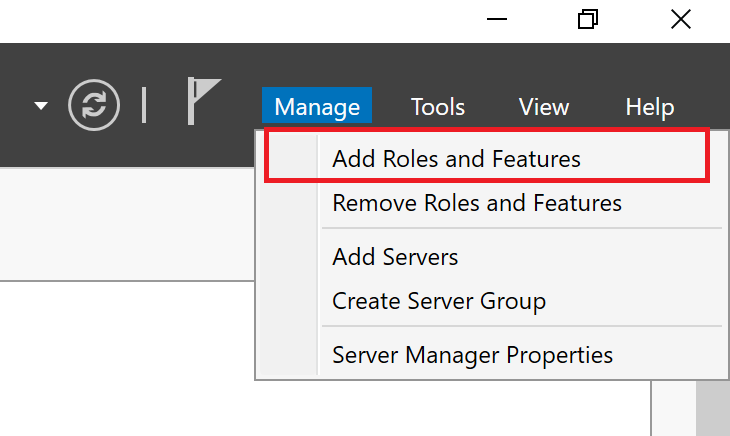

-   Upon clicking a few “Next” Buttons, you will come to the “Server Roles”
    screen where you can **check the DFS Namespace** checkbox.

-   Complete the enabling role by walking through rest of the wizard with
    default options.

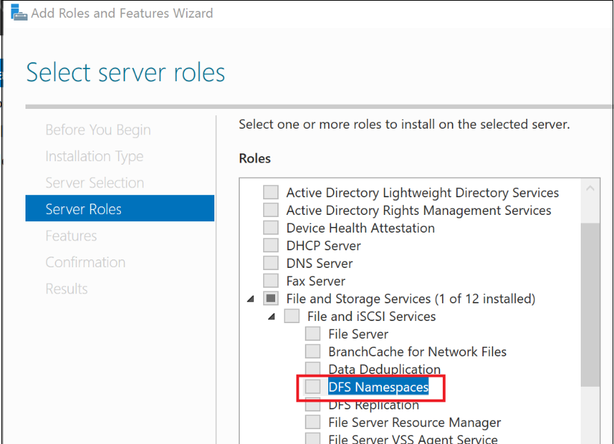

Step 3 - Create a new DFS Namespace
===================================

-   On Server Manager, click on **Tools -\> DFS Management**

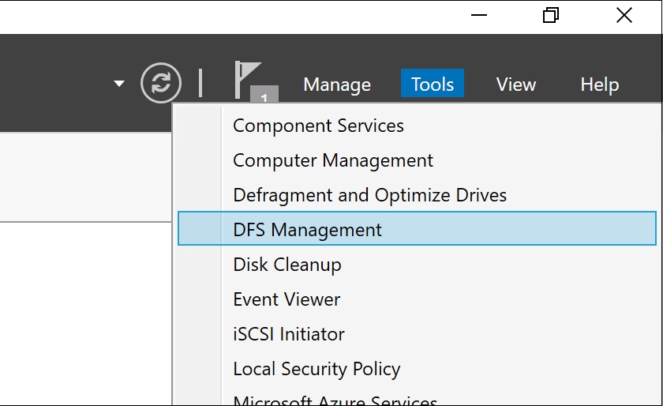

-   Create a new namespace by right clicking on **Namespaces**

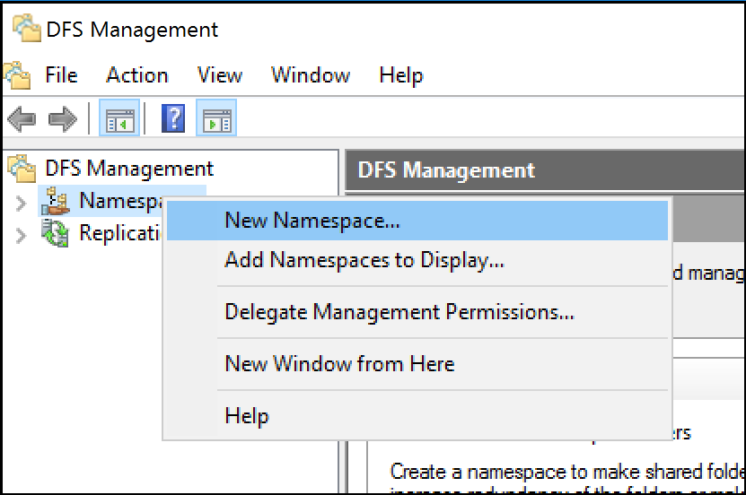

-   Add your server name (in my case it is pfsdemo1)

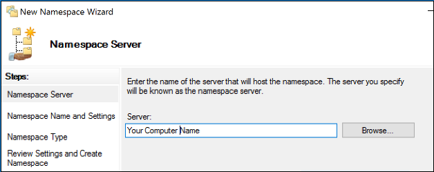

-   You can provide any name for your namespace. In my case, I chose to make it
    AzureFileShares

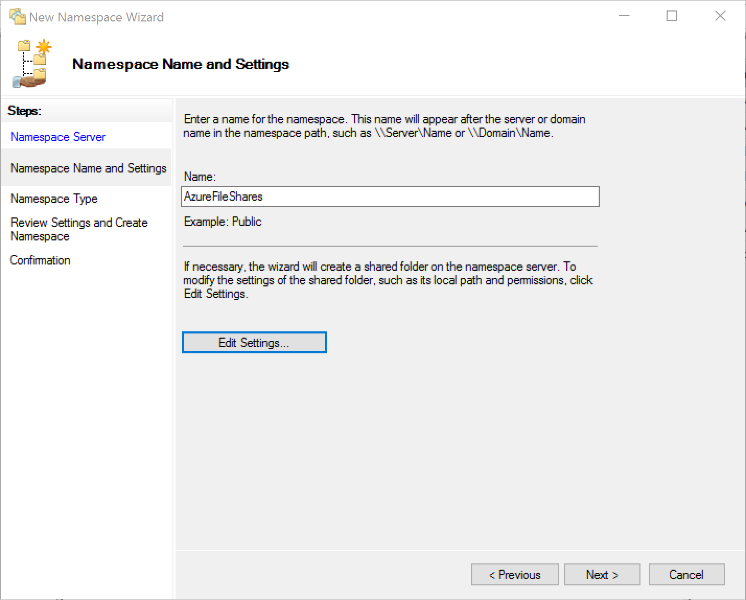

Step 4: Map Azure Files File Shares to Folders
==============================================

-   Right Click on the newly created namespace to start adding the file share
    mapping

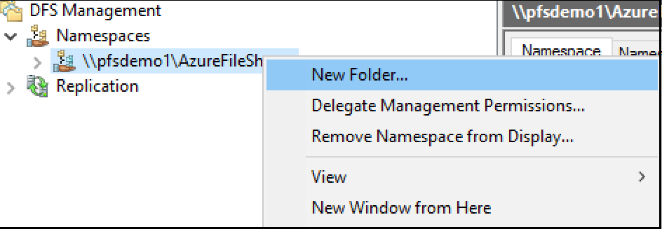

-   I mapped all my shares to folders under the namespace I created one by one.

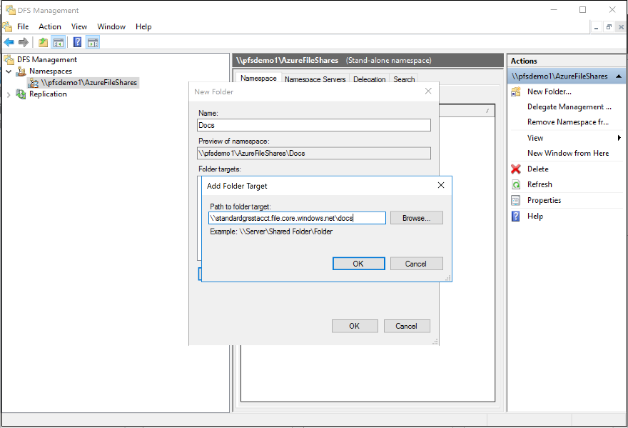

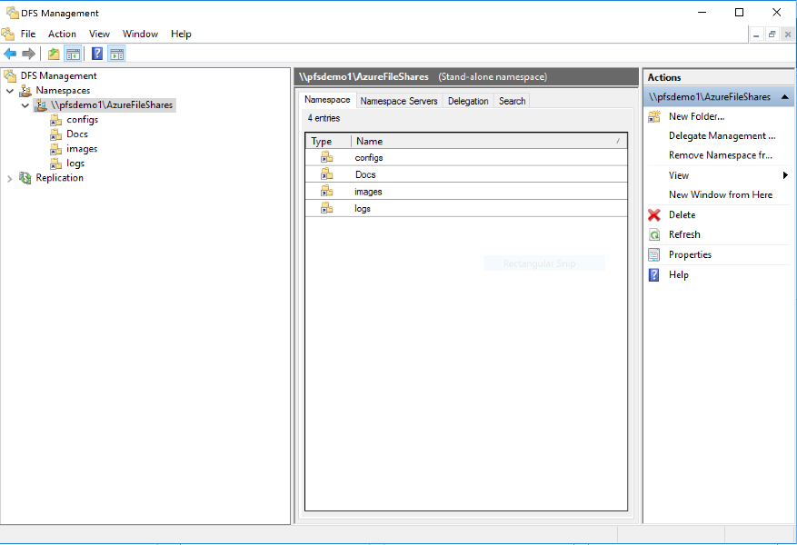

Step 5:Set up the client machineS (from where you can access this namespace)
============================================================================

Note – You will have to repeat this step on every Client Machine.

Login to any client machine and persist the credentials
-------------------------------------------------------

-   Run the following command with appropriate substitutions to add the Storage
    account credentials to Key Manager to persist connection.

| cmdkey /add:**\<YourStrageAccountName\>**.file.core.windows.net /user:**\<YourStorageAccountName\>** /pass:**\<StorageAccountKeyEndingWith==\>** |
|--------------------------------------------------------------------------------------------------------------------------------------------------|

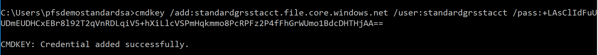

-   Run the following command with appropriate substitutions to add the DFS-N
    Server credentials to Key Manager to persist connection. In my case the
    **ServerName** is **pfsdemo1.**

| cmdkey /add:\<ServerName\> /user:**\<YourStorageAccountName\>** /pass:**\<StorageAccountKeyEndingWith==\>** |
|-------------------------------------------------------------------------------------------------------------|

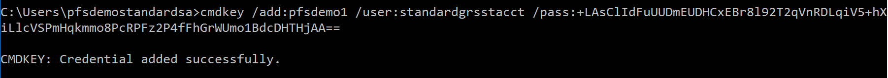

Step 6: Start using Azure Files with Your custom DFS Namespace
==============================================================

-   dir [\\\\pfsdemo1\\AzureFileShares](file:///\\pfsdemo1\AzureFileShares\logs)

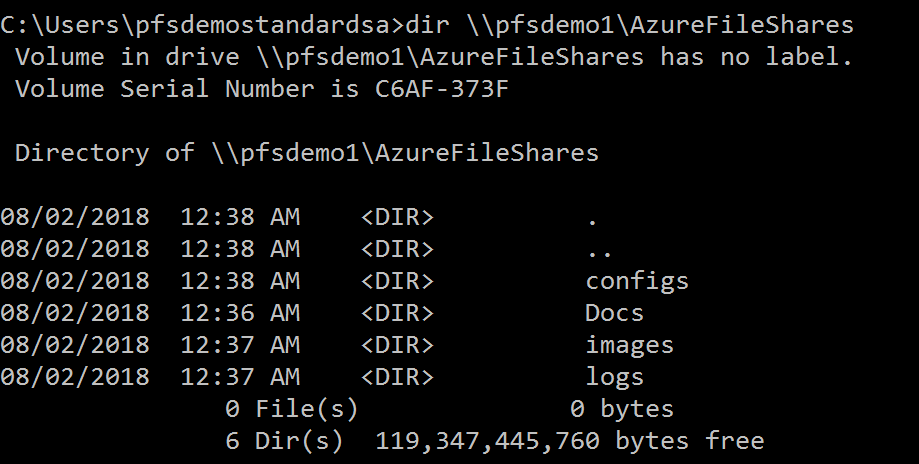

-   Or open up the explorer and start browsing files.

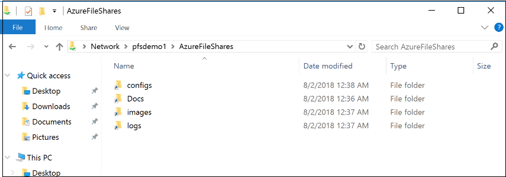

Conclusions
===========

That’s it. You have your custom namespace with each folder that can go up to
5TB.
